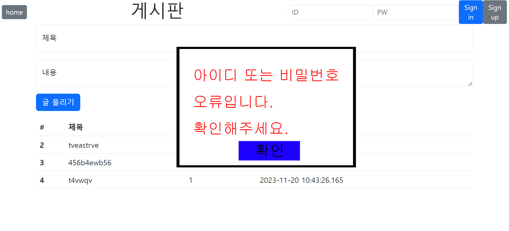

# Java,Python 기반 공공데이터 융합 SW 엔지니어 양성과정

## (전공)응용 소프트웨어 개발하기

## 통합 구현

### 28일 과제 : 개인 프로젝트 설계

### 27일 과제 : 대댓글 추가
- 현재 구현된 댓글 분석 및 댓글에 대한 대댓글 추가
    - Test는 4단계까지
- UI(사용자 이름, 작성날짜) 수정

### 25일 마감 : 개인 프로젝트 주제 선정 및 분석

### 24일 과제 / 27일 마감 : 댓글 추가
- 대댓글 가능(카톡, 줄인 내용을 출력 후 클릭 시 해당 댓글로 이동)

### 23일 과제 : 게시글 확인 수정
- 게시글 페이징
- 특정 게시글 내용 보기, 수정 삭제
- 게시글에서 작성자 마우스 오버 시 해당 작성자 정보 모달창으로 확인(전체X)
    - 깃 주소

### 22일 과제 : 회원 정보 + 게시판
- 로그인 후 게시글 작성 가능
- 게시글 목록에서 사용자 확인 가능
    - DB 초기화 추천

### 21일 과제 : 예외처리

- 조건

  - ID
    - 길이 : 3 ~ 20
    - 영어 or 숫자
  - PW
    - 길이 : 10~30
    - 대소문자, 숫자, 특수문자(!@#$%^&) 포함
  - 이름
    - 한글 길이 : 2~10
    - 영어 길이 : 4~20
  - 전화번호
    - "-"를 포함한 12~13 
    - "-"를 제외한 10~11
    - DB에는 "-" 포함하여 저장
  - 주소(입력 시)
    - 길이 : 5~100
  - Email
    - .com || .org || .co.kr || .net 으로 종료될 것
    - 중간에 @가 들어갈 것
  - 깃주소(입력 시)
    - 아이디만 입력 시 "https://github.com/" 포함하여 저장

- 결과는 아래와 같이 modal 창으로 처리 - 외부 클릭 불가능
  
  - 메세지는 알아서(중복되지 않도록)
- 예외 처리는 알아서(Java든 JS든)

### 20일 과제 : User 관련 페이지 구현, Git에 푸쉬해둘것

- 21일 오전 8시 30분 확인 예정
- Github 주소는 단톡방에 공유(각자 달라서 못찾겠음)

### 17일 과제 Board, User 테이블 생성 전체 명령어 내용 단톡방에 공유

- Database 접속 포함 CMD 창에서 사용하는 모든 코드 포함
- user(database) 생성 포함
